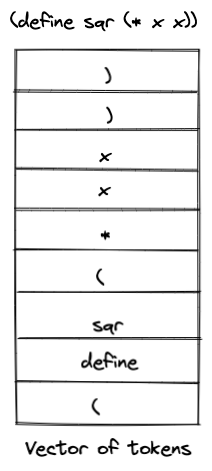

# Lexer

## Source file

**lexer.rs**

## Code Walk Through

**Lexer** is a component of the interpreter that takes the program text and converts it to a stream of atomic units known as **tokens**. Every token has a type and may even have a value associated with it. In the case of our interpreter, there are four types of tokens. The four tokens can be represented using a Rust enum as follows.

```Rust
pub enum Token {
    Integer(i64),   
    Symbol(String),                 
    LParen,     
    RParen,           
}
```

- Integer: A signed 64-bit integer
- Symbol: Any group of characters other than an integer or parenthesis
- LParen: Left parenthesis
- RParen: Right parenthesis


The first step in implementing a lexer is to replace the parenthesis with an extra space before and after it. For example,

```Lisp
(define sqr (* x x))
```

will get converted to

```Lisp
( define sqr ( * x x ) )
```

With this simple trick, the process of tokenization involves splitting the Lisp program with whitespace. 

```Rust
    let program2 = program.replace("(", " ( ")
                          .replace(")", " ) ");
    let words = program2.split_whitespace();
```

Once the words for the program are obtained, they can be converted into tokens using Rust's pattern matching as follows

```Rust
let mut tokens: Vec<Token> = Vec::new();
for word in words {
    match word {
        "(" => tokens.push(Token::LParen),
        ")" => tokens.push(Token::RParen),
        _ => {
            let mut chars = word.chars();
            let first_char = chars.next().unwrap();
            if first_char.is_digit(10) {
                let integer = word.parse::<i64>().unwrap();
                tokens.push(Token::Integer(integer));
            } else {
                tokens.push(Token::Symbol(word.to_string()));
            }
        }
    }
}
``` 


At this point, we have a vector of tokens for the entire Lisp program. Note that a vector in Rust is a stack, hence the tokens are stored in the vector in the reverse order as shown below with an example. 



## Testing

The lexer code can be unit tested as shown below

```
let tokens = tokenize("(+ 1 2)");
assert_eq!(
    tokens,
    vec![
        Token::LParen,
        Token::Symbol("+".to_string()),
        Token::Integer(1),
        Token::Integer(2),
        Token::RParen,
    ]
);
```

To cement your understanding of the Lexing process please go through the remaining tests in **lexer.rs**
